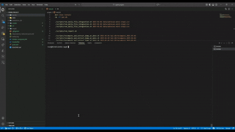

# French National Address Database - Incremental Storage System

A production-ready Apache Spark application that efficiently stores daily snapshots of the French National Address Database (Base Adresse Nationale) using incremental change detection and Parquet storage format.

## Table of Contents

- [Problem & Solution](#problem--solution)
- [Tech Stack](#tech-stack)
- [Project Structure](#project-structure)
- [Getting Started](#getting-started)
  - [Prerequisites](#prerequisites)
  - [Compilation](#compilation)
  - [Docker Setup](#docker-setup)
- [Usage](#usage)
  - [1. Daily File Integration](#1-daily-file-integration)
  - [2. Daily Report](#2-daily-report)
  - [3. Recompute Dump at Date](#3-recompute-dump-at-date)
  - [4. Compute Diff Between Files](#4-compute-diff-between-files)
- [Testing](#testing)
  - [Integration Test Suite](#integration-test-suite)
  - [Expected Data Structure](#expected-data-structure)
- [Professor Integration Test](#professor-integration-test)
- [Implementation Details](#implementation-details)

## Problem & Solution

### The Challenge
The French BAL (Base Adresse Locale) dataset is available as a daily snapshot at approximately 1.4 GB compressed CSV. Storing complete daily dumps for long-term retention (30+ years) would require:

```
30 years × 365 days × 2 GB = 21,900 GB ≈ 21 Petabytes
```

This naive approach is economically unfeasible.

### The Solution
This project implements a **Change Data Capture (CDC)** strategy using Apache Spark:

- **Incremental Storage**: Only INSERT, UPDATE, and DELETE operations are stored daily
- **Parquet Format**: Efficient columnar storage with compression
- **Hive Partitioning**: Data partitioned by day for optimal query performance
- **SHA-256 Hashing**: Detect data changes by comparing cryptographic hashes

**Data Structure:**
```
bal.db/
├── bal_latest/          # Current complete snapshot (overwritten daily)
└── bal_diff/            # Incremental changes partitioned by day
    ├── day=2025-01-01/
    ├── day=2025-01-02/
    └── ...
```

Daily incremental files are expected to be only a few megabytes instead of gigabytes, making 30+ year retention practical.

## Tech Stack

- **Language**: Java 11
- **Framework**: Apache Spark 3.5.0 (spark-sql)
- **Build Tool**: Maven 3.x
- **Storage Format**: Parquet with Hive partitioning
- **Data Source**: CSV with semicolon delimiter (`;`)
- **Primary Key**: `cle_interop` (unique address identifier)
- **Hash Algorithm**: SHA-256 for change detection

## Project Structure

```
spark-project/
├── pom.xml                          # Maven configuration
├── docker-compose.yml               # Docker environment setup
├── Dockerfile                       # Spark development container
├── scripts/                         # Shell scripts for job execution
│   ├── run_daily_file_integration.sh
│   ├── run_report.sh
│   ├── recompute_and_extract_dump_at_date.sh
│   ├── compute_diff_between_files.sh
│   └── test.sh                      # Integration test suite
├── data/                            # Sample CSV files
│   ├── adresses-mini-step1.csv
│   ├── adresses-mini-step2.csv
│   └── adresses-mini-step3.csv
└── src/main/java/fr/esilv/
    ├── SparkMain.java               # Entry point with command routing
    └── jobs/
        ├── IntegrationJob.java      # Daily incremental integration
        ├── ReportJob.java           # Statistics and reports
        ├── RecomputeJob.java        # Reconstruct snapshot at date
        └── DiffJob.java             # Compare two parquet datasets
```

### Job Descriptions

1. **IntegrationJob**: Ingests daily CSV files, computes differences (INSERT/UPDATE/DELETE), and stores incremental changes
2. **ReportJob**: Generates statistical reports on the latest data (addresses per department, totals, etc.)
3. **RecomputeJob**: Reconstructs the complete address database as of a specific historical date
4. **DiffJob**: Compares two Parquet datasets and outputs differences

## Getting Started

### Prerequisites

- Java 11 or higher
- Apache Maven 3.x
- Apache Spark 3.5.0 (for local execution)
- Docker & Docker Compose (optional, for containerized environment)

### Compilation

Build the project with Maven:

```bash
mvn clean install
```

This generates the uber JAR: `target/spark-project-1.0-SNAPSHOT.jar`

### Docker Setup

For a containerized Spark environment with all dependencies pre-installed:

```bash
# Start the container
docker compose up -d

# Access the container shell
docker exec -it spark_project_env bash

# Inside the container, compile and run
mvn clean install
```

The container includes:
- Eclipse Temurin JDK 11
- Apache Maven
- Apache Spark 3.5.0
- Mounted volumes for project code and data

To stop the container:

```bash
docker compose down
```

## Usage

All jobs are executed via `spark-submit` through shell scripts located in the `scripts/` directory.

### 1. Daily File Integration

Integrates a CSV file for a specific date, computing and storing incremental changes.

**Script:** `run_daily_file_integration.sh`

**Syntax:**
```bash
./scripts/run_daily_file_integration.sh <date> <csvFile>
```

**What it does:**
- Reads the CSV file with semicolon delimiter
- Computes SHA-256 hash for each record
- Compares with previous snapshot (`bal_latest`)
- Identifies INSERT, UPDATE, DELETE operations
- Stores differences in `bal.db/bal_diff/day=<date>/`
- Updates `bal.db/bal_latest/` with the new snapshot

### 2. Daily Report

Generates aggregate statistics on the latest address data.

**Script:** `run_report.sh`

**Syntax:**
```bash
./scripts/run_report.sh
```

**What it does:**
- Reads the current snapshot from `bal_latest`
- Computes total addresses and communes
- Aggregates statistics by department (département)
- Displays top 10 departments by address count

**Sample Output:**
```
=== BAL Report Job ===

=== Global Statistics ===
Total addresses: 245789
Total communes: 1847

=== Top 10 Departments ===
+------------+----------+---------+
|departement |addresses |communes |
+------------+----------+---------+
|75          |89234     |20       |
|69          |45678     |293      |
|13          |42156     |119      |
...
+------------+----------+---------+
```

### 3. Recompute Dump at Date

Reconstructs the complete address database as it existed on a specific historical date.

**Script:** `recompute_and_extract_dump_at_date.sh`

**Syntax:**
```bash
./scripts/recompute_and_extract_dump_at_date.sh <date> <outputDir>
```

**What it does:**
- Reads all incremental changes up to the target date from `bal_diff`
- Applies changes chronologically
- For each address (`cle_interop`), keeps only the latest operation
- Excludes DELETEd addresses
- Outputs the reconstructed snapshot to the specified directory

### 4. Compute Diff Between Files

Compares two Parquet datasets and identifies differences.

**Script:** `compute_diff_between_files.sh`

**Syntax:**
```bash
./scripts/compute_diff_between_files.sh <parquetDir1> <parquetDir2>
```

**What it does:**
- Loads both Parquet datasets
- Computes hash values if not present
- Identifies INSERT operations (in dataset2 but not dataset1)
- Identifies DELETE operations (in dataset1 but not dataset2)
- Identifies UPDATE operations (same key but different hash)

## Testing

### Integration Test Suite

The `test.sh` script validates all four features with sample data:

```bash
./scripts/test.sh
```

### Test Execution Demo



*The GIF above shows the complete test execution in real-time. Below you'll find a detailed step-by-step breakdown with outputs and analysis for better readability.*

### Test Data Overview

The test uses three sample CSV files with controlled changes to validate the CDC logic:

1. **adresses-mini-step1.csv**: 10 addresses (baseline)
2. **adresses-mini-step2.csv**: 
   - Deletes 2 addresses
   - Modifies 2 addresses
   - Adds 1 new address
   - **Result**: 9 addresses total
3. **adresses-mini-step3.csv**: 
   - Re-inserts the 2 previously deleted addresses
   - Modifies 1 address
   - **Result**: 11 addresses total

### Step-by-Step Test Execution

#### Step 1: Integration Jobs

We run the three daily integrations to process the CSV files and store incremental changes.

**Commands:**
```bash
./scripts/run_daily_file_integration.sh 2025-01-01 data/adresses-mini-step1.csv
./scripts/run_daily_file_integration.sh 2025-01-02 data/adresses-mini-step2.csv
./scripts/run_daily_file_integration.sh 2025-01-03 data/adresses-mini-step3.csv
```

**Output:**
```bash
=============== Integration Job ==============
Date: 2025-01-01
CSV File: data/adresses-mini-step1.csv
Insertions: 10
Deletions: 0
Updates: 0
=== Integration Job Completed Successfully ===
=============== Integration Job ==============
Date: 2025-01-02
CSV File: data/adresses-mini-step2.csv
Insertions: 1
Deletions: 2
Updates: 2
=== Integration Job Completed Successfully ===
=============== Integration Job ==============
Date: 2025-01-03
CSV File: data/adresses-mini-step3.csv
Insertions: 2
Deletions: 0
Updates: 1
=== Integration Job Completed Successfully ===
```

**Analysis:**
- **Day 1 (2025-01-01)**: First run, all 10 addresses are INSERTED    
- **Day 2 (2025-01-02)**: Detects 2 DELETES, 2 UPDATES, and 1 INSERT → confirms the changes in step2.csv
- **Day 3 (2025-01-03)**: Detects 2 INSERTS (re-added addresses) and 1 UPDATE → confirms the changes in step3.csv

The output numbers match exactly the description of each CSV file's modifications.

#### Step 2: Report Generation

We generate a statistical report on the latest data (as of day 3).

**Command:**
```bash
./scripts/run_report.sh
```

**Output:**
```bash
=============== BAL Report Job ===============

=== Global Statistics ===
Total addresses: 11
Total communes: 9

=== Top 10 Departments ===
+-----------+---------+--------+
|departement|addresses|communes|
+-----------+---------+--------+
|01         |5        |4       |
|03         |3        |2       |
|02         |3        |3       |
+-----------+---------+--------+


=== Department Summary ===
+-----------+-------------+-------------+-------------+
|departments|avg_addresses|min_addresses|max_addresses|
+-----------+-------------+-------------+-------------+
|3          |4            |3            |5            |
+-----------+-------------+-------------+-------------+

======= Report Completed Successfully ========
```

**Analysis:**
The report shows **11 total addresses**, which is consistent with our CSV data:
- Started with 10 addresses
- Day 2: -2 +1 = 9 addresses
- Day 3: +2 = 11 addresses

The department breakdown and statistics reflect the current state after all operations.

#### Step 3: Recompute Historical Snapshots

We reconstruct the database state at each of the three dates to verify time-travel capabilities.

**Commands:**
```bash
./scripts/recompute_and_extract_dump_at_date.sh 2025-01-01 bal.db/recompute_2025-01-01
./scripts/recompute_and_extract_dump_at_date.sh 2025-01-02 bal.db/recompute_2025-01-02
./scripts/recompute_and_extract_dump_at_date.sh 2025-01-03 bal.db/recompute_2025-01-03
```

**Output:**
```bash
==== Recompute Job Completed Successfully ====
Target date: 2025-01-01
Output directory: bal.db/recompute_2025-01-01
Total diffs to process: 10

Operations breakdown:
+---------+-----+
|operation|count|
+---------+-----+
|INSERT   |10   |
+---------+-----+


Final address count at 2025-01-01: 10
Dump saved to: bal.db/recompute_2025-01-01
=============== Recompute Job ================
==== Recompute Job Completed Successfully ====
Target date: 2025-01-02
Output directory: bal.db/recompute_2025-01-02
Total diffs to process: 15

Operations breakdown:
+---------+-----+
|operation|count|
+---------+-----+
|DELETE   |2    |
|INSERT   |11   |
|UPDATE   |2    |
+---------+-----+


Final address count at 2025-01-02: 9
Dump saved to: bal.db/recompute_2025-01-02
=============== Recompute Job ================
==== Recompute Job Completed Successfully ====
Target date: 2025-01-03
Output directory: bal.db/recompute_2025-01-03
Total diffs to process: 18

Operations breakdown:
+---------+-----+
|operation|count|
+---------+-----+
|DELETE   |2    |
|INSERT   |13   |
|UPDATE   |3    |
+---------+-----+


Final address count at 2025-01-03: 11
Dump saved to: bal.db/recompute_2025-01-03
=============== Recompute Job ================
```

**Analysis:**
- **2025-01-01**: Final count = 10 addresses (initial baseline)
- **2025-01-02**: Final count = 9 addresses (10 - 2 deleted + 1 added)
- **2025-01-03**: Final count = 11 addresses (9 + 2 re-inserted)

Each recomputed snapshot correctly reflects the expected state at that point in time, validating the incremental storage approach.

#### Step 4: Diff Between Snapshots

We compare the recomputed snapshots to verify that differences are correctly identified.

**Commands:**
```bash
./scripts/compute_diff_between_files.sh bal.db/recompute_2025-01-01 bal.db/recompute_2025-01-02
./scripts/compute_diff_between_files.sh bal.db/recompute_2025-01-01 bal.db/recompute_2025-01-03
./scripts/compute_diff_between_files.sh bal.db/recompute_2025-01-02 bal.db/recompute_2025-01-03
```

**Output:**
```bash
================= Diff Job ===================
Parquet Dir 1: bal.db/recompute_2025-01-01
Parquet Dir 2: bal.db/recompute_2025-01-02
Insertions: 1
Deletions: 2
Updates: 2
====== Diff Job Completed Successfully =======
================= Diff Job ===================
Parquet Dir 1: bal.db/recompute_2025-01-01
Parquet Dir 2: bal.db/recompute_2025-01-03
Insertions: 1
Deletions: 0
Updates: 3
====== Diff Job Completed Successfully =======
================= Diff Job ===================
Parquet Dir 1: bal.db/recompute_2025-01-02
Parquet Dir 2: bal.db/recompute_2025-01-03
Insertions: 2
Deletions: 0
Updates: 1
====== Diff Job Completed Successfully =======
```

**Analysis:**
- **Day1 → Day2**: Shows 1 INSERT, 2 DELETES, 2 UPDATES (matches step2 operations)
- **Day1 → Day3**: Shows cumulative differences across both days
- **Day2 → Day3**: Shows 2 INSERTS and 1 UPDATE (matches step3 operations)

The diff operations accurately retrace all the modifications described in our CSV files.

### Expected Data Structure

After running the complete test suite:

```
bal.db/
├── bal_latest/                    # Current snapshot (11 addresses)
│   └── part-00000-*.parquet
├── bal_diff/                      # Incremental changes
│   ├── day=2025-01-01/
│   │   └── part-00000-*.parquet   # 10 INSERTs
│   ├── day=2025-01-02/
│   │   └── part-00000-*.parquet   # 1 INSERT, 2 DELETEs, 2 UPDATEs
│   └── day=2025-01-03/
│       └── part-00000-*.parquet   # 2 INSERTs, 1 UPDATE
├── recompute_2025-01-01/          # Reconstructed snapshot (10 addresses)
├── recompute_2025-01-02/          # Reconstructed snapshot (9 addresses)
└── recompute_2025-01-03/          # Reconstructed snapshot (11 addresses)
```

## Professor Integration Test

To run the complete integration test with 50 daily dumps (2025-01-01 to 2025-02-20):

**Prerequisites:** Place the 50 CSV dump files in `c:/data/` as:
```
c:/data/dump-2025-01-01
c:/data/dump-2025-01-02
...
c:/data/dump-2025-02-20
```

**Execution:**

```bash
#!/bin/bash

# Compile and clean
mvn clean install
rm -rf bal.db

# Process 50 days
for n in $(seq 1 50); do 
    day=$(date -d "2025-01-01 +${n} day" +%Y-%m-%d)
    echo "Processing day ${n}: ${day}"
    ./scripts/run_daily_file_integration.sh ${day} c:/data/dump-${day}
    ./scripts/run_report.sh
done

# Recompute and compare
./scripts/recompute_and_extract_dump_at_date.sh 2025-01-24 c:/temp/dumpA
./scripts/recompute_and_extract_dump_at_date.sh 2025-02-10 c:/temp/dumpB
./scripts/compute_diff_between_files.sh c:/temp/dumpA c:/temp/dumpB
```

**Expected Result:**

```
bal.db/
├── bal_latest/              # Final snapshot (2025-02-20)
├── bal_diff/                # 50 daily partitions
│   ├── day=2025-01-02/
│   ├── day=2025-01-03/
│   ...
│   └── day=2025-02-20/

c:/temp/
├── dumpA/                   # Recomputed at 2025-01-24
└── dumpB/                   # Recomputed at 2025-02-10
```

## Implementation Details

### Change Detection with SHA-256 Hashing

To detect modifications without comparing every column, the system computes a SHA-256 hash of all columns:

```java
// Sort columns alphabetically for consistency
String[] sortedColumns = Arrays.stream(dataset.columns())
        .sorted()
        .toArray(String[]::new);

// Concatenate all columns with delimiter and hash
dataset.withColumn("hash_value", 
    sha2(concat_ws("||", sortedColumns), 256));
```

This allows efficient comparison: if hashes differ, the record has been modified.

### Partitioning Strategy

Data is partitioned by the `day` column using Hive-style partitioning:

```java
dataset.write()
    .mode(SaveMode.Append)
    .partitionBy("day")
    .parquet(BAL_DIFF_PATH);
```

Benefits:
- Efficient time-range queries
- Partition pruning for better performance
- Easy to manage retention policies (delete old partitions)

### First Run vs Incremental Runs

**First Run:**
- No previous data exists (`bal_latest` is empty)
- All records are marked as INSERT
- Establishes the initial baseline

**Incremental Runs:**
- Compares new data with `bal_latest`
- Detects INSERT (new keys), DELETE (missing keys), UPDATE (same key, different hash)
- Stores only the differences

### Handling Duplicate Keys

The source CSV files contain duplicates on the unique key (`cle_interop`) where only position columns (coordinates) vary slightly. To handle this:

```java
dataset.dropDuplicates("cle_interop");
```

This deduplication step keeps the first occurrence of each `cle_interop`, ensuring data integrity and preventing false positives in change detection. Without this, minor position variations would be incorrectly flagged as updates.

**Data Source:** [French National Address Database (BAL)](https://adresse.data.gouv.fr/data/ban/adresses/latest/csv-bal/adresses-france.csv.gz)
